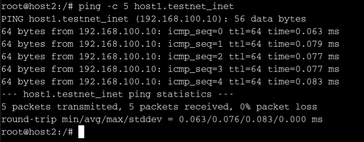
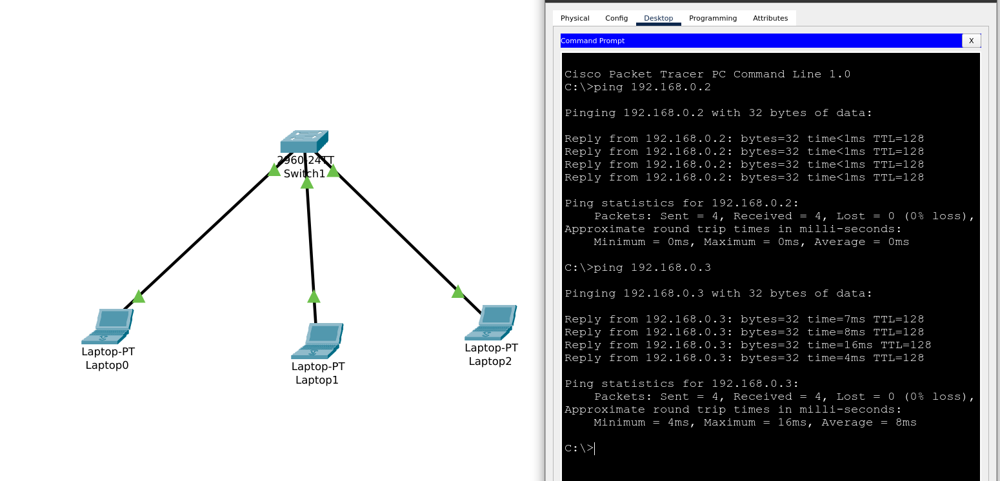

## Networking Training - Module 3 & 4

### Q1 : Simulate a small network with switches and multiple devices. Use ping to generate traffic and observe the MAC address table of the switch. Capture packets using wireshark to analyze ethernet frames and MAC addressing.

Simulated Network  

ARP table (host 1)  

Captured packets in wireshark  

### Q2 : Capture and analyze ethernet frames using wireshark. Inspect the structure of the frame, including destination and source MAC addresses, Ethertype, payload and FCS. Use GNS3 or Packet Tracer to simulate network traffic.

Inspecting Structure of the frame  

### Q3 : Configure static IP addresses, modify MAC addresses, and verify network connectivity using ping and ifconfig commands  

Changing MAC address  

Changing IP address  

Verifying Network connectivity   

### Q4 : Troubleshoot ethernet communication with ping and traceroute (using cisco packet tracer)

### Q5 : Create a simple LAN setup with two linux machines connected via a switch

LAN setup of linux machines   

### Q6 : Ping from one machine to other. If it fails, use ifconfig to ensure the IP addresses are configured correctly

Pinging the machines  

### Q7 : Use traceroute to identify where the packets are being dropped if the ping fails

### Q8 : Research the Linux kernel's handling of ethernet devices and network interfaces. Write a short report on how the linux kernel supports ethernet communication

The handling of ethernet devices and network interfaces in the linux kernel is primarily done with the help of **Network Devices APIs** (https://www.kernel.org/doc/html/v4.14/networking/kapi.html) which includes the core **socket API**. The **socket buffers** and **socket filters** are used to loop over pages and run a packet through a socket filter.

The ethernet devices are handled by the respective **ethernet device drivers** which can be verified at https://www.kernel.org/doc/html/v4.14/networking/kapi.html#driver-support . For example, the base driver for handling *Intel Ethernet Network Connection* and all of its functionality is available at https://docs.kernel.org/networking/device_drivers/ethernet/intel/e1000.html .

### Q9 : Describe how you would configure a basic LAN interface using the ip command in linux

 1. Identify the interface using the command `ip link show` and let the interface be `eth0`
 2. If the interface is down, bring it up with the command `ip link set dev eth0 up`
 3. Assign IP address and subnet mask to a device `ip addr add 192.168.0.10/24 dev eth0` 
 4. Ping any device to verify connectivity. 

### Q10 : use linux to view the MAC address table of a switch. Use the bridge or ip link commands to inspect the MAC table and demonstrate a basic switch's operation

