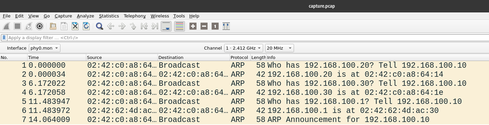
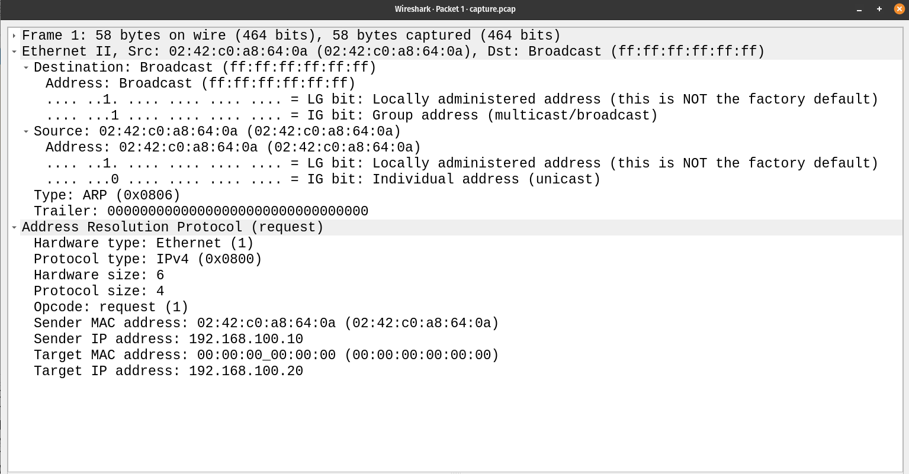
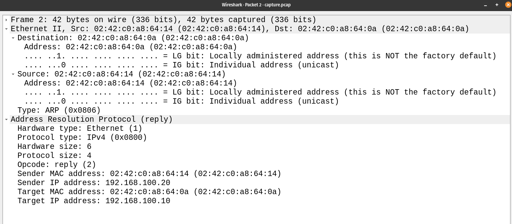
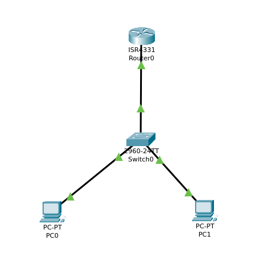
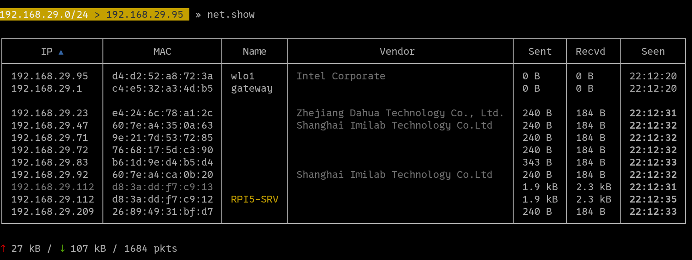
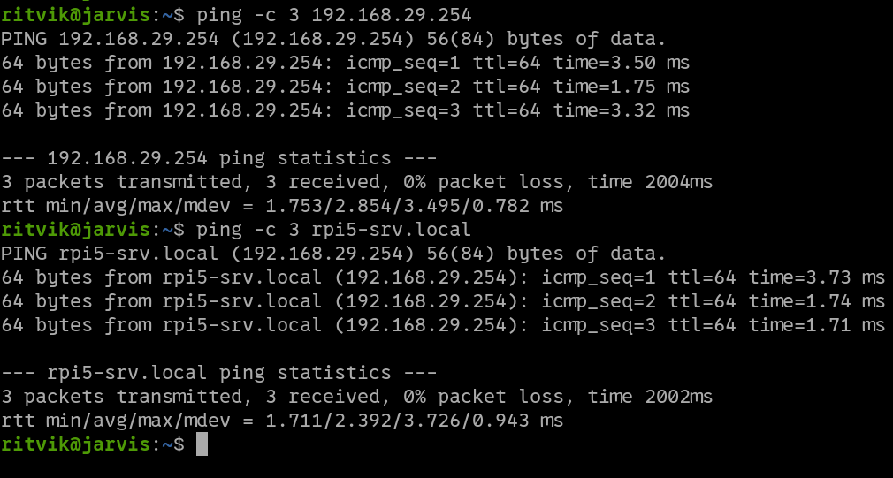
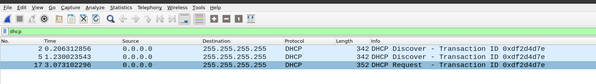
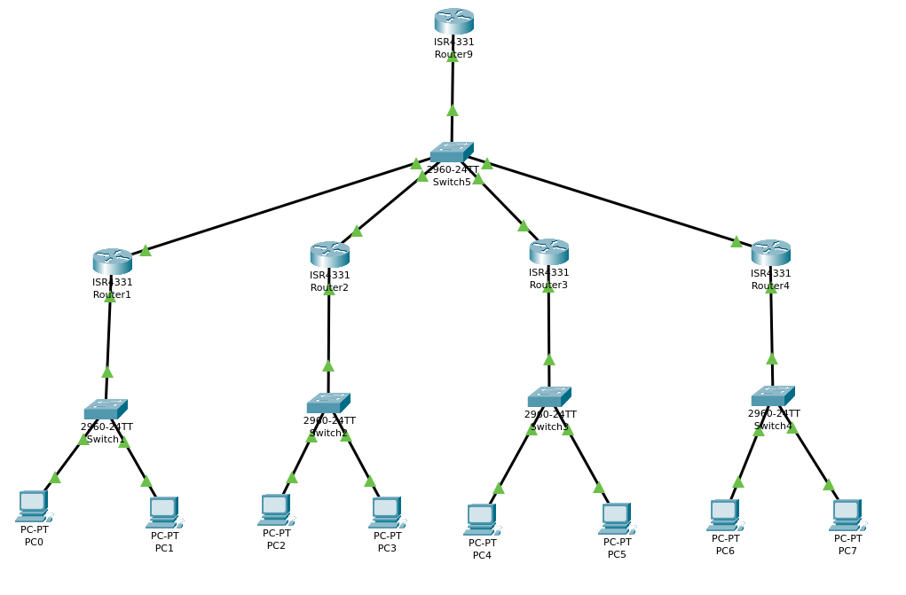
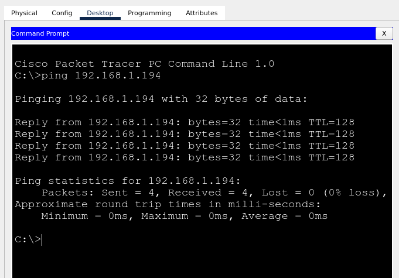

## Networking Training - Module 5

### Q1 : Capture and analyze ARP packets using wireshark. Inspect the ARP request and reply frames and discuss the role of sender's IP and MAC address in these packets.

The packets are captured in [this file](./capture.pcap)

The arp request is inspected below

The arp response is inspected below

In the ARP request, the source IP address, source MAC address and the destination IP address are known and are specified. The destination MAC address is set to multicast/broadcast in the network and the target MAC address is set to all zeroes (00:00:00:00:00:00) indicating the sender does not know the MAC address of the target.This ARP request is sent to all the devices in the network and the device with the target IP address can reply with its MAC address. The sender's IP address and MAC address ensures that the target can unicast the ARP response to the sender instead of broadcasting/multicasting the ARP response.

### Q2: Using packet tracer, simulate an ARP spoofing attack. Analyze the behaviour of devices on the network when they recieve a malicious ARP response.

The following network is simulated in packet tracer 

PC0 has an IP address of 192.168.1.10 and the NIC MAC is 0000.0CD2.585A
PC1 has an IP address of 192.168.1.20 and the NIC MAC is 0001.437C.1C01
The router is set up for a network of 192.168.1.0/24 and has an IP address of 192.168.1.1 with NIC MAC 0001.437C.1C01

The MAC address of the PC2 (attacker PC) is the same to that of the MAC address of the router. 

So on changing the MAC address of the attacker PC to the MAC address of the router, the victim (PC0) assumes that data transfer is happening between it and the router but instead the attacker is snooping all traffic by spoofing the MAC address.

### Q3: Manually configure static IPs on the client devices (like PC or your mobile phone) and verify connectivity using ping

Static IP is configured for the device `192.168.29.254` with the hostname `rpi5-srv`

Pinging the device and verifying connectivity

### Q4: Use wireshark to capture DHCP discover, offer, request and acknowledge messages and explain the process

The dhcp packets are captured in wireshark 

The DHCP steps are commonly referred to as the DORA steps, that is

- Discover : Initially the DHCP client broadcasts a DHCPDISCOVER message to find the available DHCP servers in the network.
- Offer : The DHCP server responds to the DHCPDISCOVER with a DHCPOFFER message to the client. This offer message includes the IP address to be assigned to the client, the subnet mask and other network details.
- Request : The client broadcasts DHCPREQUEST confirming the request of the IP address to it.
- Acknowledge : The DHCP server then responds to the DHCPREQUEST of the client with a DHCPACK message confirming the IP address assignment.

### Q5: Given an IP address range of 192.168.1.0/24. divide the network into 4 subnets

Given address range - 192.168.1.0/24  
Total addresses in the range - 256  
For 4 equal subnets, each subnet must have 256/4 = 64 addresses  
Number of used bits for 64 addresses = log2(64)=6   
Total fixed bits = 32-6 = 26  
Therefore, the subnets are /26 networks with 4 network ids.  

|Network ID | usable ip | broadcast addr | subnet mask |
|---|---|---|---|
| 192.168.1.0 | 192.168.1.1 - 192.168.1.62 | 192.168.1.63 | 192.168.1.0/26 |
| 192.168.1.64 | 192.168.1.65 - 192.168.1.126 | 192.168.1.127 | 192.168.1.64/26 |
| 192.168.1.128 | 192.168.1.129 - 192.168.1.190 | 192.168.1.191 | 192.168.1.128/26 |
| 192.168.1.192 | 192.168.1.193 - 192.168.1.254 | 192.168.1.255 | 192.168.1.192/26 |

The subnets are simulated in packet tracer

Verifying connectivity

### Q6: You are given three IP addresses: 10.1.1.1, 172.16.5.10, and 192.168.1.5. Identify the class of each IP address (Class A, B, or C). What is the default subnet mask for each class? Provide the range of IP addresses for each class.

| ip address |	Class	| IP Address Range Class | Subnet Mask |
| :---:        |    :----:   |          :---: | :---: |
| 10.1.1.1 |  A | 0.0.0.0 - 127.255.255.255 | 255.0.0.0|
| 172.16.5.10 |  B | 128.0.0.0 - 191.255.255.255 | 255.255.0.0|
| 192.168.1.5 |  C | 192.0.0.0 - 223.255.255.255 | 255.255.255.0|In Cisco Packet Tracer, create a small network with multiple devices (e.g., 2 PCs and a router). Use private IP addresses (e.g., 192.168.1.x) on the PCs and configure the router to perform NAT to allow the PCs to access the internet. Test the NAT configuration by pinging an external IP address from the PCs and capture the traffic using Wireshark. What is the source IP address before and after NAT?