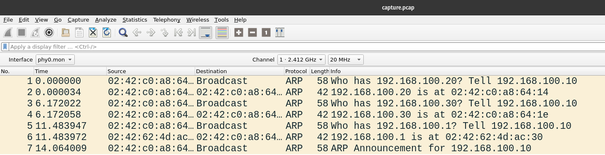
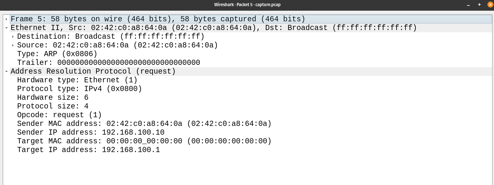
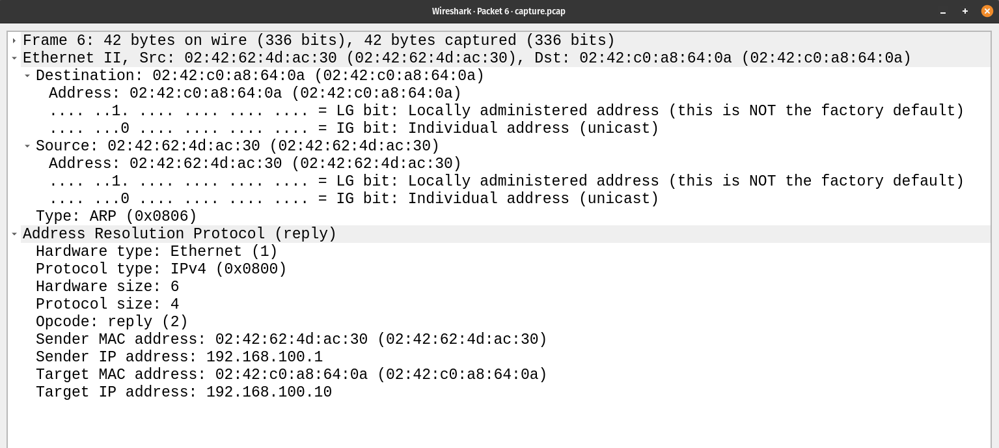
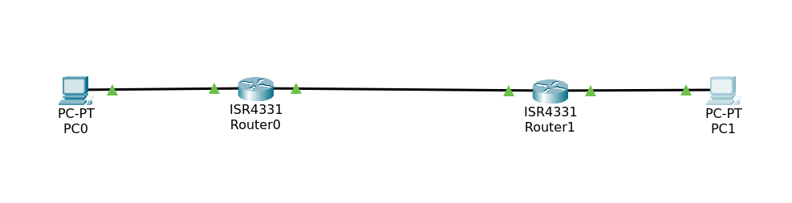
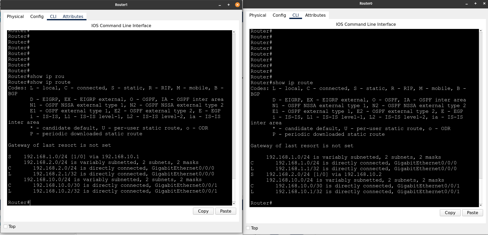
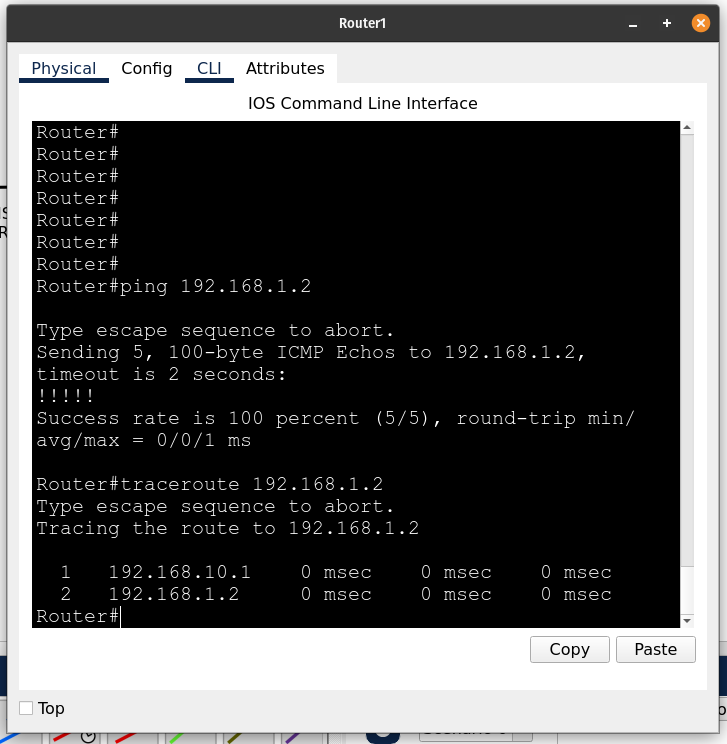
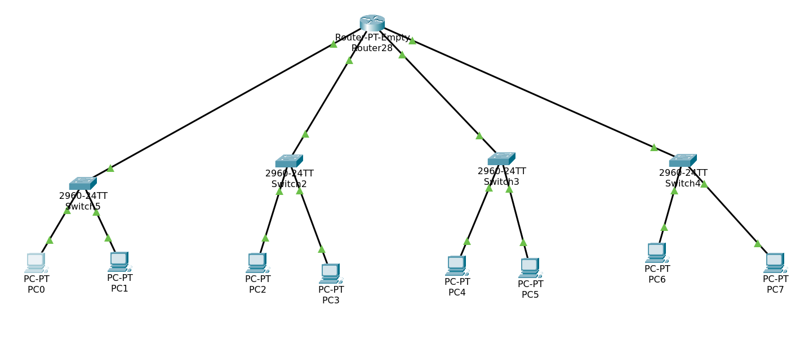
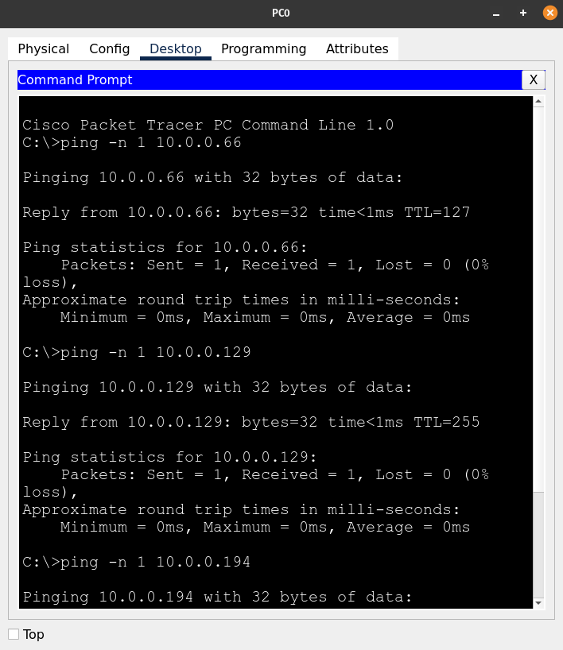
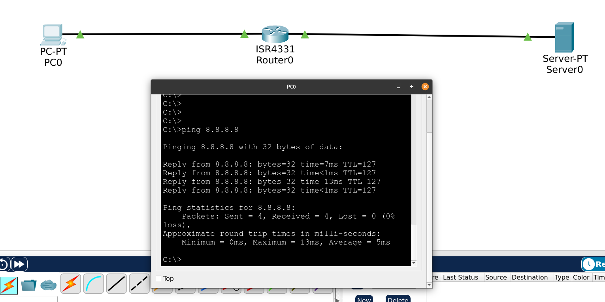

## Networking Training - Module 6

### Q1 : Capture and analyze ARP packets using Wireshark. Inspect the ARP request and reply frames when your device attempts to find the router's MAC address. Discuss the importance of ARP in packet forwarding.

The packets are captured in [this file](./capture.pcap)


The arp request (to the router) is inspected below


The arp response (from the router) is inspected below


In the ARP request, the source IP address, source MAC address and the destination IP address are known and are specified. The destination MAC address is set to multicast/broadcast in the network and the target MAC address is set to all zeroes (00:00:00:00:00:00) indicating the sender does not know the MAC address of the target.This ARP request is sent to all the devices in the network and the device with the target IP address can reply with its MAC address. The sender's IP address and MAC address ensures that the target can unicast the ARP response to the sender instead of broadcasting/multicasting the ARP response. 

### Q2 : Manually configure static routes on a router to direct packets to different subnets. Use the ip route command and verify connectivity using ping and traceroute.



Two routers `router0` and `router1` are configured with the following commands on packet tracer

for router0  
```
enable
configure terminal
interface gigabitEthernet 0/0/0
ip address 192.168.1.1 255.255.255.0
no shutdown
exit
interface gigabitEthernet 0/0/1
ip address 192.168.10.1 255.255.255.252
no shutdown
exit
```

for router1  
```
enable
configure terminal
interface gigabitEthernet 0/0/0
ip address 192.168.2.1 255.255.255.0
no shutdown
exit
interface gigabitEthernet 0/0/1
ip address 192.168.10.2 255.255.255.252
no shutdown
exit
```

*Configuring static routes*
On `router0`   
`ip route 192.168.2.0 255.255.255.0 192.168.10.2`

on `router1`
`ip route 192.168.1.0 255.255.255.0 192.168.10.1`

Viewing the routing table



Verifying using ping and traceroute




### Q3 : Given a network address of 10.0.0.0/24, divide it into 4 equal subnets. Calculate the new subnet mask. Determine the valid host range for each subnet. Assign IP addresses to devices in Packet Tracer and verify connectivity.

Given address : 10.0.0.0/24, available IPs : 254

To divide into 4 equal subnets, we need to have 254/4 = 64 available IPs in each subnet

So by borrowing 2 bits for subnet ID, we would have /26 network.

|network| usable ip | broadcast | netmask |
|---|---|---|---|
|10.0.0.0/26 | 10.0.0.1 - 10.0.0.62 | 10.0.0.63 | 255.255.255.192 |
|10.0.0.64/26 | 10.0.0.65 - 10.0.0.126 | 10.0.0.127 | 255.255.255.192 |
|10.0.0.128/26 | 10.0.0.129 - 10.0.0.190 | 10.0.0.191 | 255.255.255.192 |
|10.0.0.192/26 | 10.0.0.193 - 10.0.0.254 | 10.0.0.255 | 255.255.255.192 |

The subnets are created as follows



Pinging each subnet device to verify connectivity




### Q4 : You are given three IP addresses: 192.168.10.5, 172.20.15.1, and 8.8.8.8. Identify the class of each IP address. Determine if it is private or public.Explain how NAT would handle a private IP when accessing the internet.

| IP | class| type |
|---|---|---|
| 192.168.10.5 |  C | private |
| 172.20.15.1 |  B | private |
| 8.8.8.8 |  A | public |

when accessing the internet, a NAT would translate the private IP into a public IP. This can be done in three ways

- Static NAT : One to one translation of IP occurs. Each private IP is mapped to a public IP.
- Dynamic NAT : An IP address is choosen from a pool of public IPs when a device in the private network tries to access the internet
- PAT (Port Address Translation) : Port numbers are used to translate the addresses. This is kind of many to one address translation as the NAT can translate each port of the public IP with any specified private IP and port.


### Q5 : In Cisco Packet Tracer, configure NAT on a router to allow internal devices (192.168.1.x) to access the internet. Test connectivity by pinging an external public IP. Capture the traffic in Wireshark and analyze the source IP before and after NAT translation.

NAT is configured on a router using the following commands

```
enable
configure terminal
interface GigabitEthernet 0/0/0
ip address 192.168.1.1 255.255.255.0
ip nat outside
no shutdown
exit
interface GigabitEthernet 0/0/1
ip address 8.8.8.1 255.255.255.0
ip nat outside
no shutdown
ip access-list standard 1
permit 192.168.1.0 0.0.0.255
exit
ip nat inside source list 1 interface gigabitEthernet 0/0/0 overload
```

To test the connectivity, we ping the public server IP from the private network



