## Networking Training - Module 7 & 8

### Q1 : Try Test-Connection and nslookup commands for below websites

www.google.com  
www.facebook.com  
www.amazon.com  
www.github.com  
www.cisco.com  

The test-connection and nslookup have been performed for the given websites

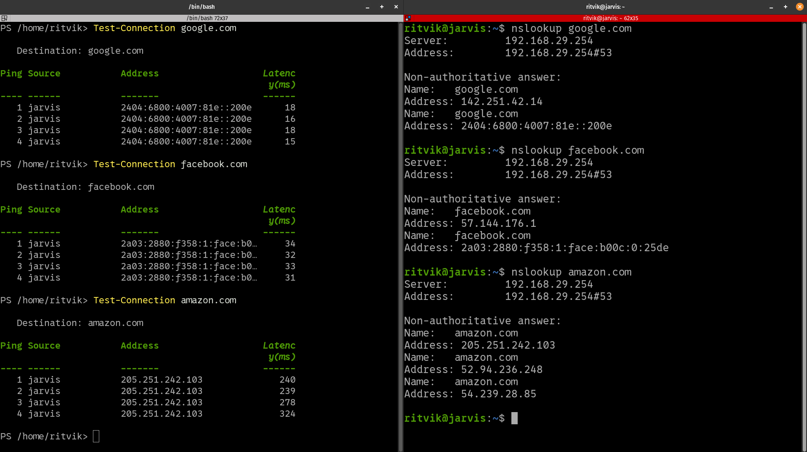
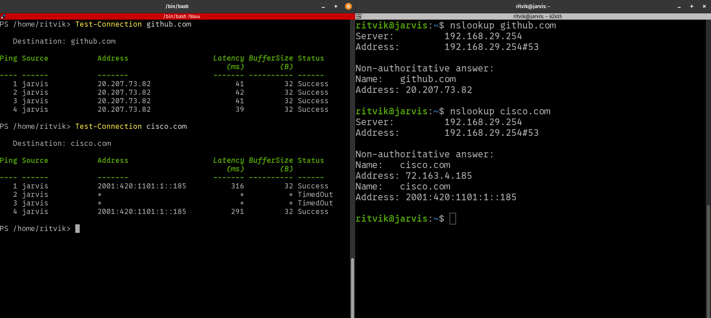

### Q2 : Use Wireshark to capture and analyze DNS, TCP, UDP traffic and packet header, packet flow, options and flags.

The captured packets are in [this file](./capture.pcap)

DNS and UDP traffic

query  
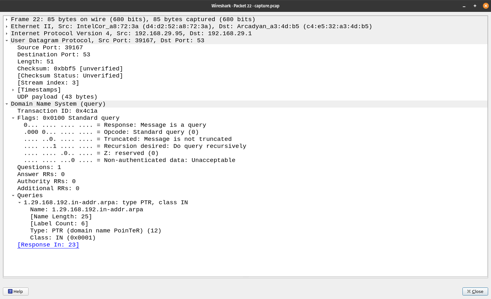

response  
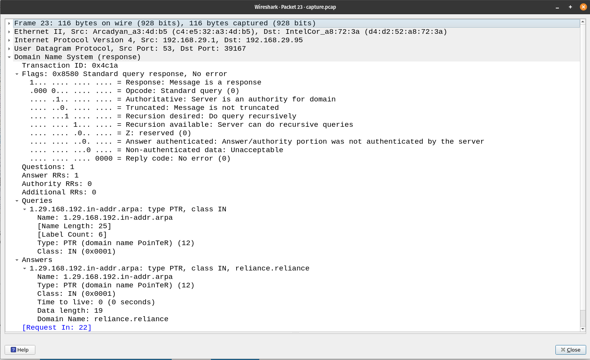

TCP traffic  

  -g gate,...  --gateway=gate,...
                              Route packets through the specified gateway
                              (maximum 8 for IPv4 and 127 for IPv6)
  -I  --icmp                  Use ICMP ECHO for tracerouting
  -T  --tcp                   Use TCP SYN for tracerouting (default port is 80)
  -i device  --interface=device
                              Specify a network interface to operate with
  -m max_ttl  --max-hops=max_ttl
                              Set the max number of hops (max TTL to be
                              reached). Default is 30
  -N squeries  --sim-queries=squeries
                              Set the number of probes to be tried
                              simultaneously (default is 16)
  -n                          Do not resolve IP addresses to their domain names
  -p port  --port=port        Set the destination port to use. It is either
                              initial udp port value for "default" method
                              (incremented by each probe, default is 33434), or
                              initial seq for "icmp" (incremented as well,
                              default from 1), or some constant destination
                              port for other methods (with default of 80 for
                              "tcp", 53 for "udp", etc.)
  -t tos  --tos=tos           Set the TOS (IPv4 type of service) or TC (IPv6
                              traffic class) value for outgoing packets
  -l flow_label  --flowlabel=flow_label
                              Use specified flow_label for IPv6 packets
  -w MAX,HERE,NEAR  --wait=MAX,HERE,NEAR
                              Wait for a probe no more than HERE (default 3)
                              times longer than a response from the same hop,
                              or no more than NEAR (default 10) times than some
                              next hop, or MAX (default 5.0) seconds (float
                              point values allowed too)
  -q nqueries  --queries=nqueries
                              Set the number of probes per each hop. Default is
                              3
  -r                          Bypass the normal routing and send directly to a
                              host on an attached network
  -s src_addr  --source=src_addr
                              Use source src_addr for outgoing packets
  -z sendwait  --sendwait=sendwait
                              Minimal time interval between probes (default 0).
                              If the value is more than 10, then it specifies a
                              number in milliseconds, else it is a number of
                              seconds (float point values allowed too)
  -e  --extensions            Show ICMP extensions (if present), including MPLS
  -A  --as-path-lookups       Perform AS path lookups in routing registries and
                              print results directly after the corresponding
                              addresses
  -M name  --module=name      Use specified module (either builtin or external)
                              for traceroute operations. Most methods have
                              their shortcuts (`-I' means `-M icmp' etc.)
  -O OPTS,...  --options=OPTS,...
                              Use module-specific option OPTS for the
                              traceroute module. Several OPTS allowed,
                              separated by comma. If OPTS is "help", print info
                              about available options
  --sport=num                 Use source port num for outgoing packets. Implies
                              `-N 1'
  --fwmark=num                Set firewall mark for outgoing packets
  -U  --udp                   Use UDP to particular port for tracerouting
                              (instead of increasing the port per each probe),
                              default port is 53
  -UL                         Use UDPLITE for tracerouting (default dest port
                              is 53)
  -D  --dccp                  Use DCCP Request for tracerouting (default port
                              is 33434)
  -P prot  --protocol=prot    Use raw packet of protocol prot for tracerouting
  --mtu                       Discover MTU along the path being traced. Implies
                              `-F -N 1'
  --back                      Guess the number of hops in the backward path and
                              print if it differs
  -V  --version               Print version info and exit
  --help                      Read this help and exit

Arguments:
+     host          The host to traceroute to
      packetlen     The full packet length (default is the length of an IP
                    header plus 40). Can be ignored or increased to a minimal
                    allowed value

```

Performing for `google.com`

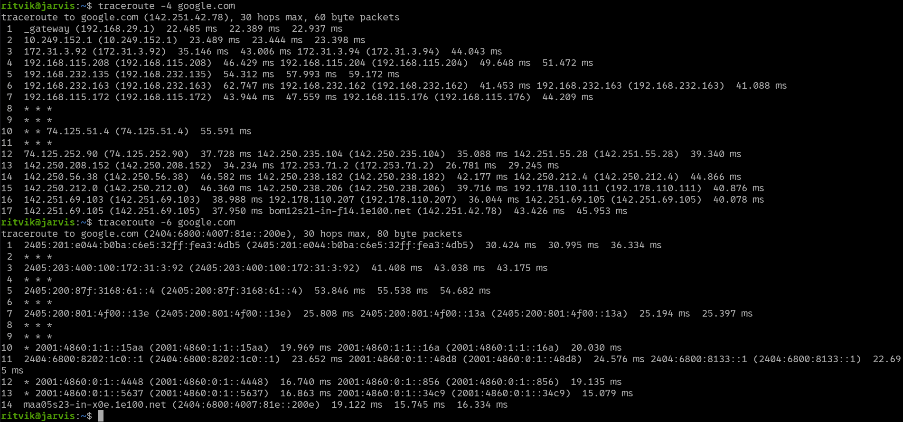
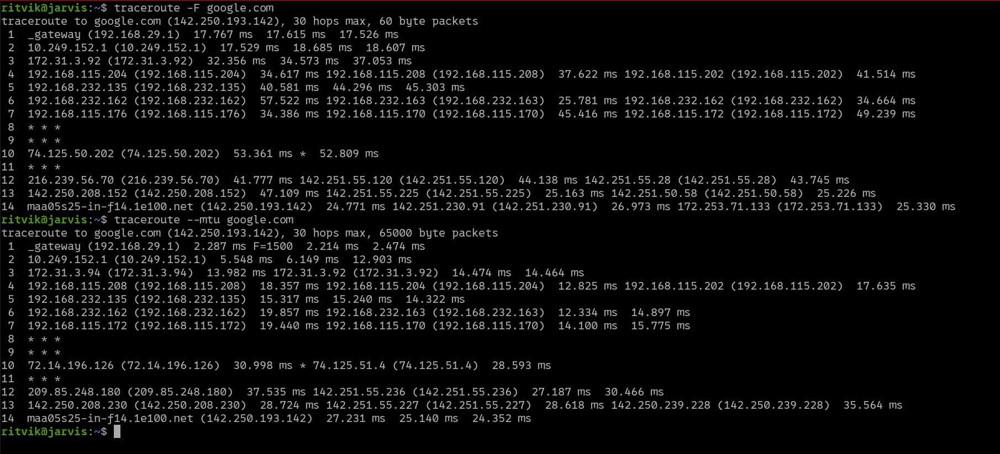


### Q4 : Set up trunk ports between switches and try ping between different VLANs

Two switches are set up with the following commands

switch0

```
enable
configure terminal
interface fastEthernet 0/1
switchport mode access
switchport access vlan 10
exit
interface fastEthernet 0/2
switchport mode access
switchport access vlan 20
exit
interface fastEthernet 0/21
switchport mode trunk
switchport trunk allowed vlan all
exit
interface vlan 10
ip address 192.168.1.1  255.255.255.0
exit
interface vlan 20
ip address 192.168.2.2  255.255.255.0
exit
exit
```

switch1  
```
enable
configure terminal
interface fastEthernet 0/1
switchport mode access
switchport access vlan 10
exit
interface fastEthernet 0/2
switchport mode access
switchport access vlan 20
exit
interface fastEthernet 0/21
switchport mode trunk
switchport trunk allowed vlan all
exit
interface vlan 10
ip address 192.168.1.2  255.255.255.0
exit
interface vlan 20
ip address 192.168.2.1  255.255.255.0
exit
exit
```

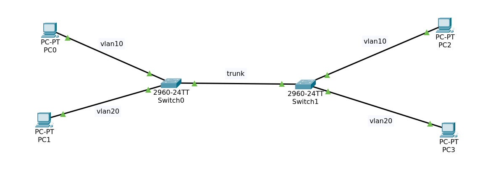

Ping from PC0 to PC2 (same vlan)

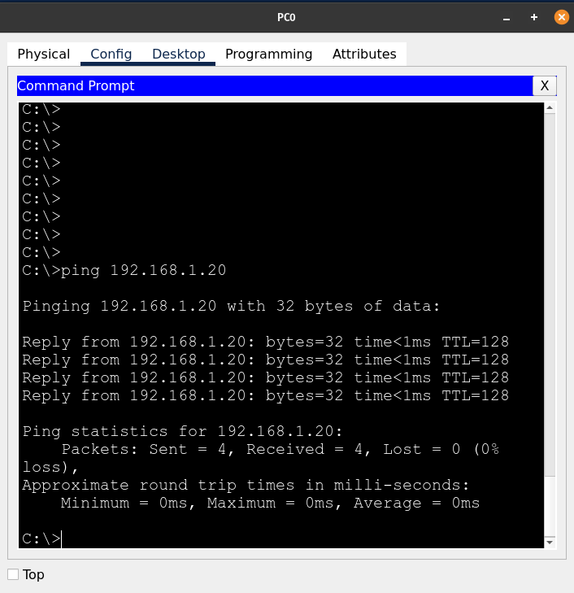

Ping from PC0 to PC3 (different vlan)

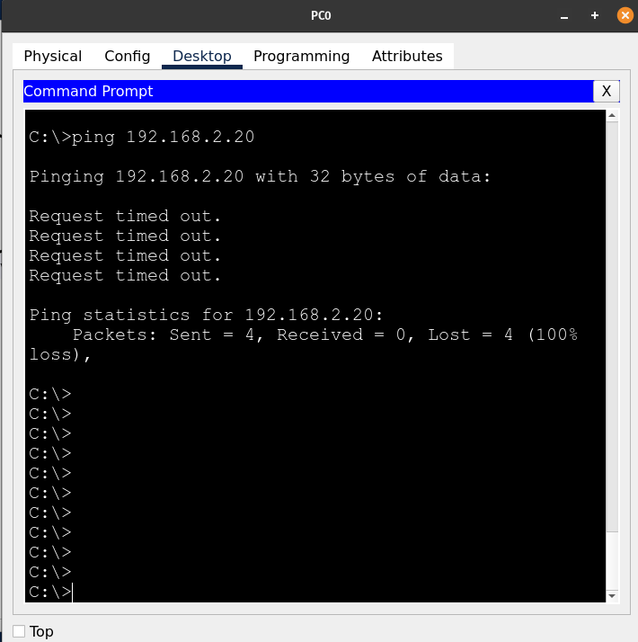

Ping from PC1 to PC3 (same vlan)

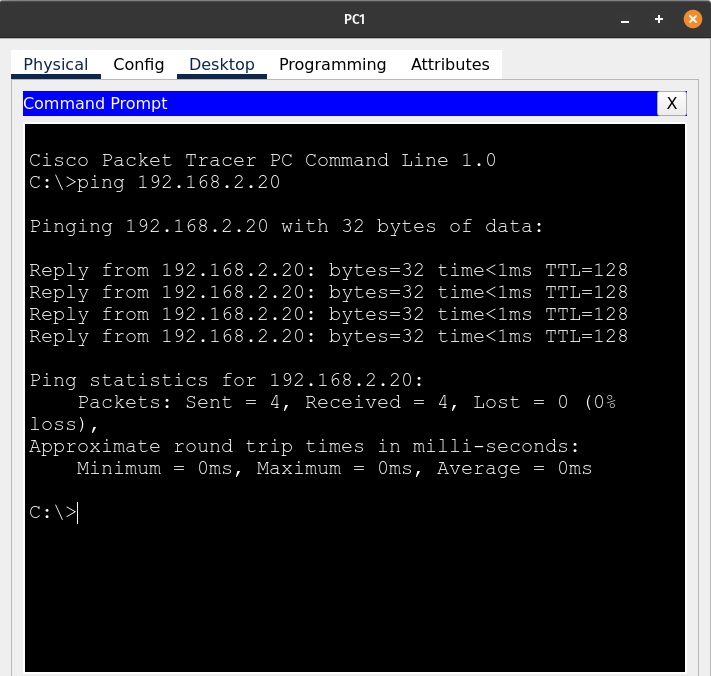

Ping from PC1 to PC2 (different vlan)

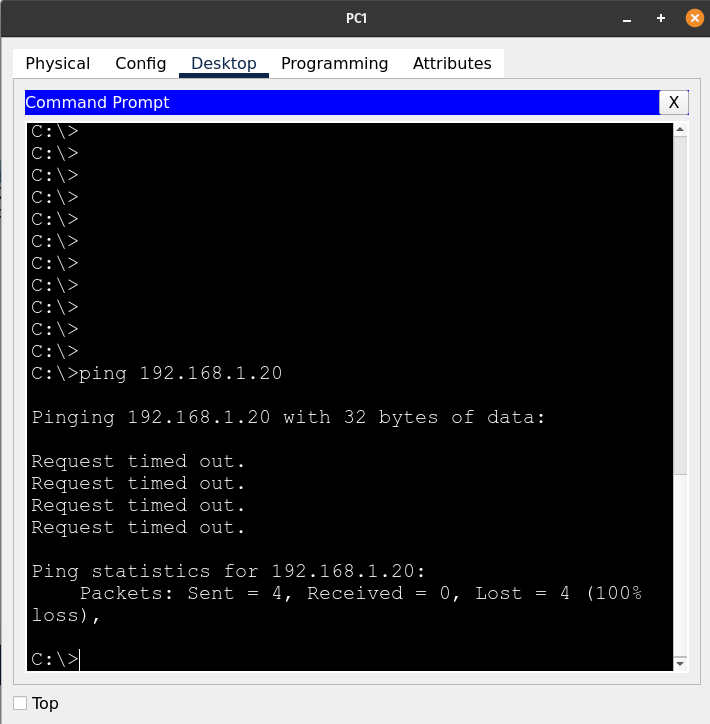


### Q5 : Change the native VLAN on a trunk port. Test for VLAN mismatches and troubleshoot.

now running the following commands we can change the native vlan to vlan99


on switch0
```
interface vlan 99
ip address 192.168.99.1
exit
interface fastEthernet 0/21
switchport trunk native vlan 99
```

on switch1
```
interface vlan 99
ip address 192.168.99.2
exit
interface fastEthernet 0/21
switchport trunk native vlan 99
```

adding one device for each switch

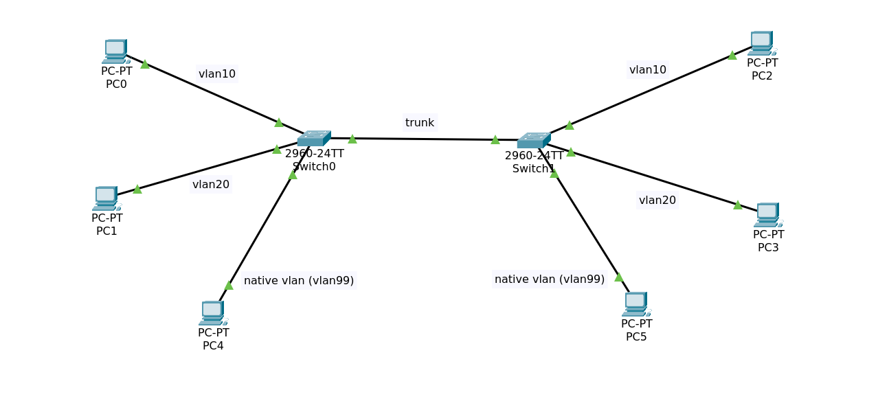

Verifying connectivity between PC4 and PC5

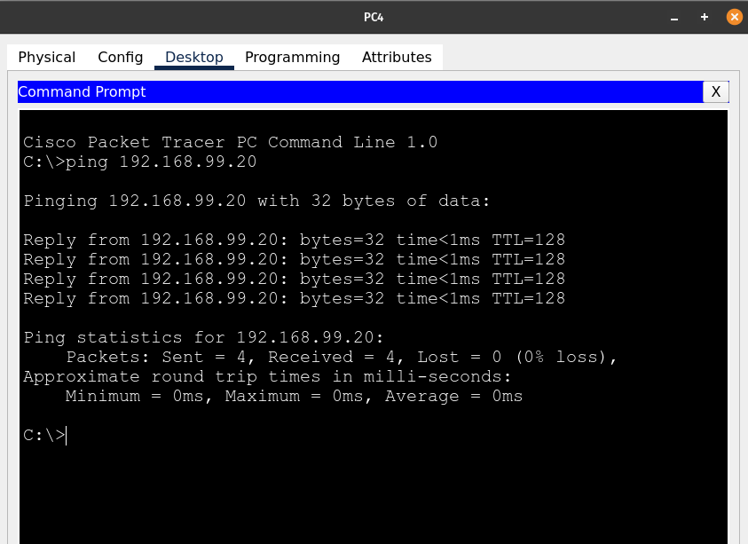

We can see that without configuring vlan access port for PC4 and PC5, they use vlan99, hence the native vlan is changed successfully.


### Q6 : Configure a management VLAN and assign an IP address for remote access. Test SSH or Telnet access to the switch.

Let the management vlan be `vlan100`

on switch0  
```
interface vlan 100
ip address 192.168.100.1 255.255.255.0
exit
interface fastEthernet 0/24
switchport mode access
switchport access vlan 100
exit
```

on switch1   
```
interface vlan 100
ip address 192.168.100.2 255.255.255.0
exit
interface fastEthernet 0/24
switchport mode access
switchport access vlan 100
exit
```

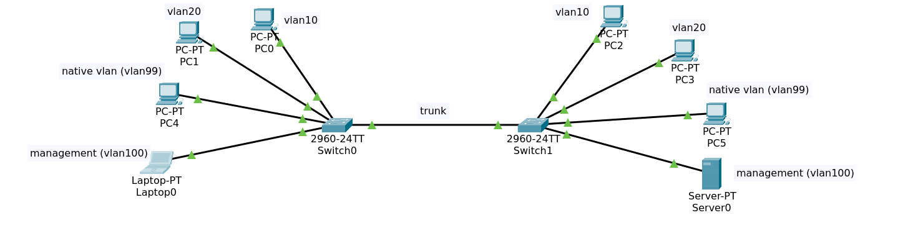

Creating a user in switch1 for management  
```
enable
configure terminal
hostname switch1
ip domain name switch1
username administrator privilege 15 secret password
```

now we can ssh into the switch1 from a device in management vlan

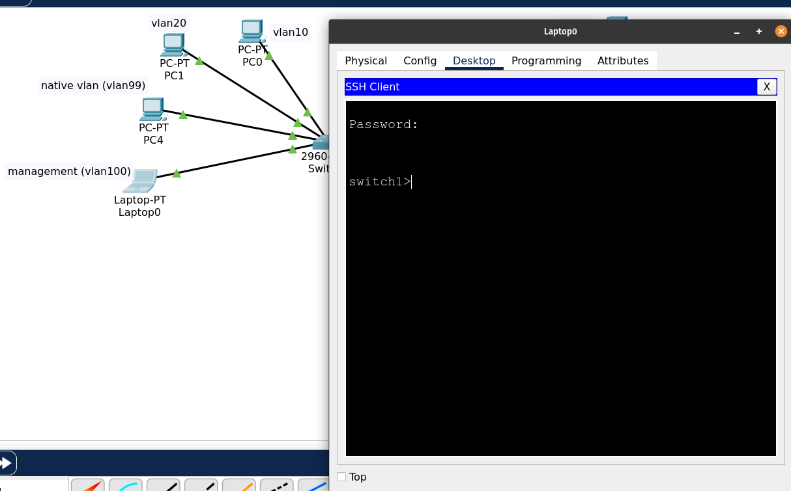


### Q7 : You have a Cisco switch and a VoIP phone that needs to be placed in a voice VLAN (VLAN 20). The data for the PC should remain in a separate VLAN (VLAN 10). Configure the switch port to support both voice and data traffic.

the switch is configured with the following commands  
```
enable
configure terminal
interface fastEthernet 0/1
switchport mode access
switchport access vlan 10
switchport voice vlan 20
exit
```

Verifying the interface

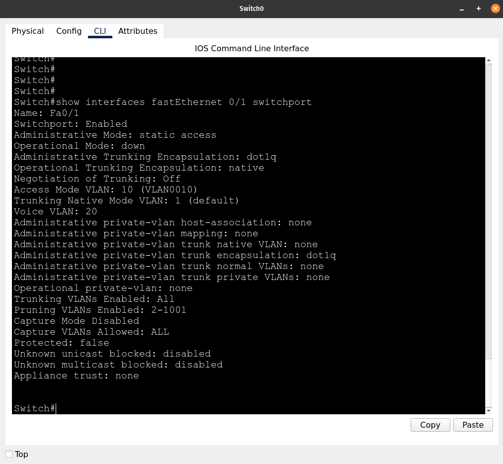

Network arrangement  

The PC is connected to PC port of the voIP phone and the switch is connected to switch port of the voIP phone. This connection ensures that the configured switch port supports both voice and data traffic. 

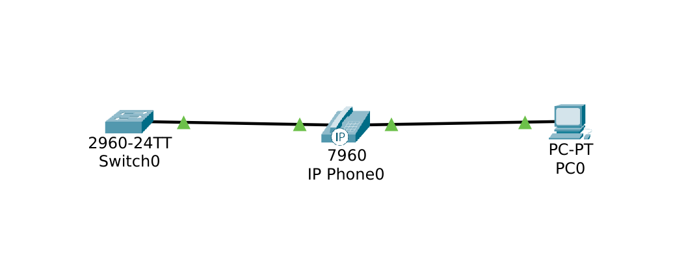


### Q8 : You configured VLANs 10 and 20 on your switch and assigned ports to each VLAN. However, devices in VLAN 10 cannot communicate with devices in VLAN 20. Troubleshoot the issue.

The switch is configured using the following commands  
```
enable 
configure terminal
interface vlan 10
ip address 192.168.10.1 255.255.255.0
exit
interface vlan 20
ip address 192.168.20.1 255.255.255.0
exit
interface fastEthernet 0/2
switchport mode access
switchport access vlan 10
exit
interface fastEthernet 0/3
switchport mode access
switchport access vlan 20
exit
```

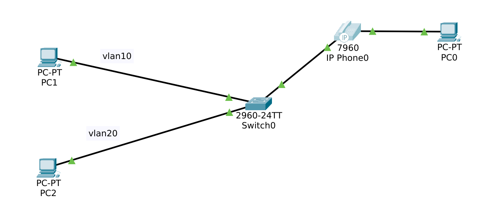

we can see that the devices in vlan10 cannot communicate with the devices in vlan20

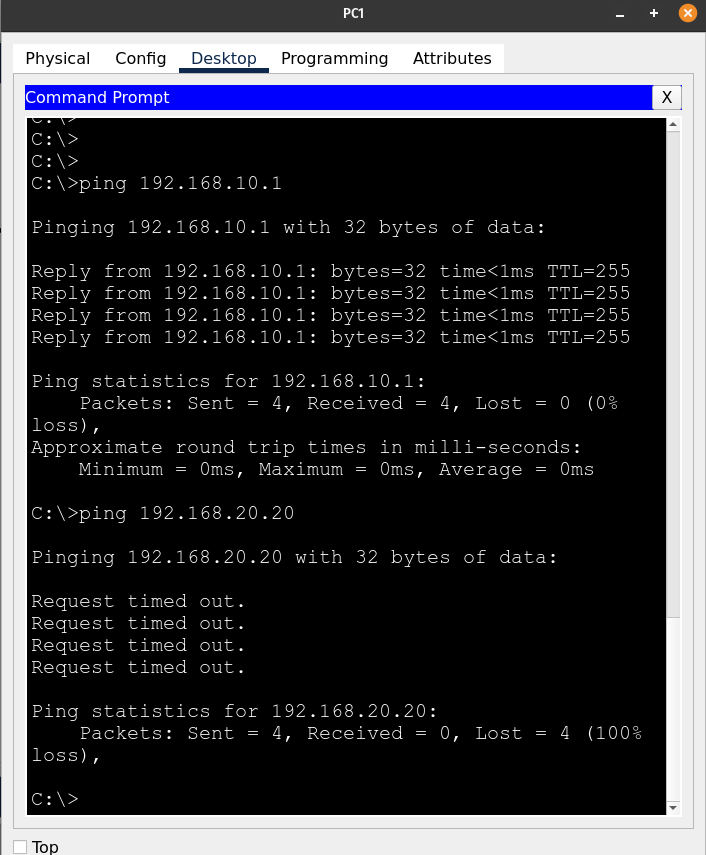

since the switch does not support inter-vlan routing, we can connect a router to the switch using a trunk port and do the inter VLAN routing on the router. 

### Q9 : Try Inter VLAN routing with Router.

The router is configured with the following commands and the devices in both vlans point their gateways to the router.  
```
enable 
configure terminal
interface gigabitEthernet 0/0
no shutdown
exit
interface gigabitEthernet 0/0.10
encapsulation dot1Q 10
ip address 192.168.10.100 255.255.255.0
exit
interface gigabitEthernet 0/0.20
encapsulation dot1Q 20
ip address 192.168.20.100 255.255.255.0
exit
```

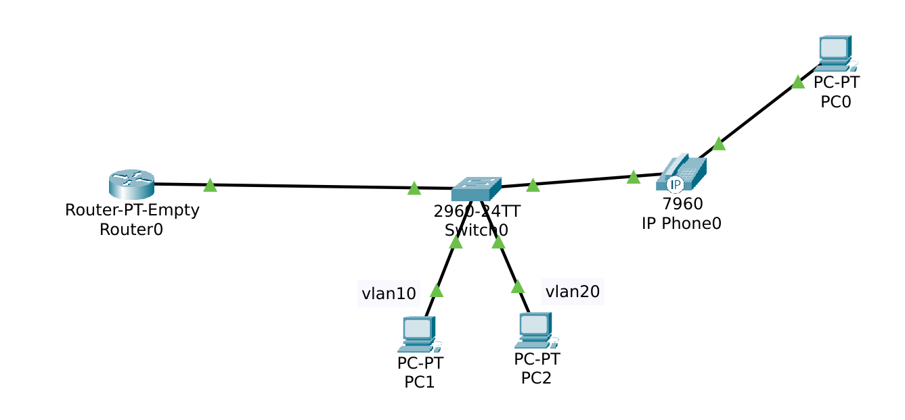

now we can see that the devices in vlan10 and vlan20 can communicate with each other

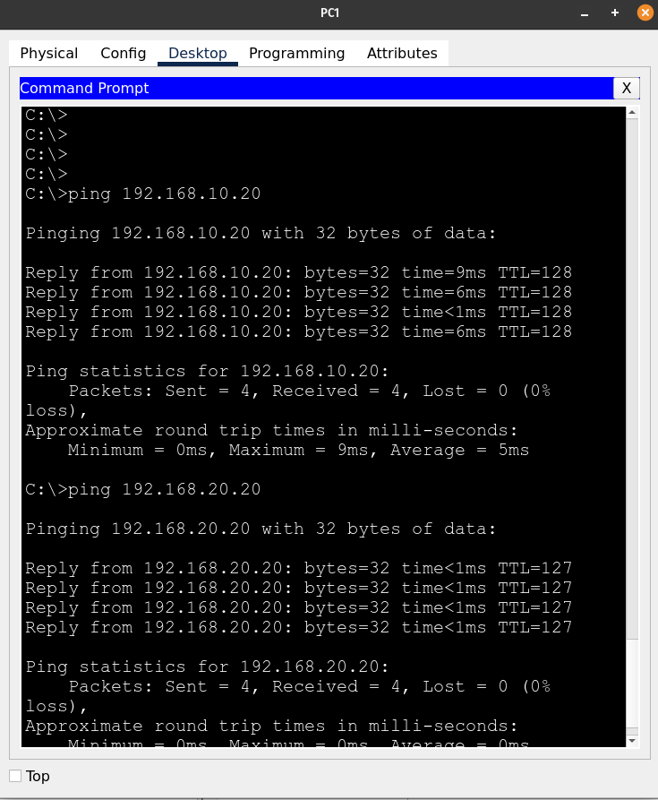

### Q10 : Implement ACLs to restrict traffic based on source and destination ports. Test rules by simulating legitimate and unauthorized traffic.

### Q11 :  Configure a standard Access Control List (ACL) on a router to permit traffic from a specific IP range. Test connectivity to verify the ACL is working as intended.

### Q12 : Create an extended ACL to block specific applications, such as HTTP or FTP traffic. Test the ACL rules by attempting to access blocked services.

### Q13 : Try Static NAT, Dynamic NAT and PAT to translate IPs.

### Q14 : Download iperf in laptop/phone and make sure they are in same network. Try different iperf commands with tcp, udp, birectional, reverse, multicast, parallel options and analyze the bandwidth and rate of transmission, delay, jitter etc.


