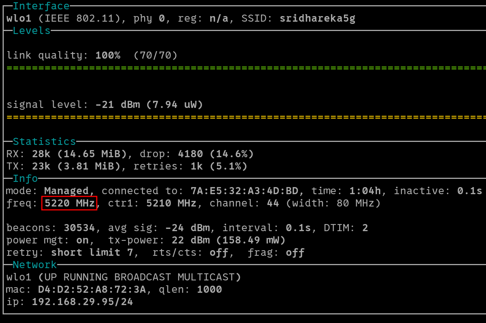

## Wifi Training - Module 1

### Q1 : In which OSI layer the Wi-Fi standard/protocol fits ?
The Wi-Fi standard/protocol fits in the Physical(layer 1) and Data Link(layer 2) of the OSI layer.

### Q2 : Can you share the Wi-Fi devices that you are using day to day life, share that device's wireless capability/properties after connecting to network. Match your device to corresponding Wi-Fi generations based on properties.

To view the capability of own device (Laptop),, we can run `iw dev <interface> link>` to view the Wi-Fi standard.

To view the capability of other devices connected in the network, we can put the wireless interface in monitor mode and capture 802.11 traffic.

Then we can view the packet of the desired device to find it's capability

The source address is used to identify the device

| Device | Standard | Wi-Fi generation |
|---|---|---|
| Laptop | 802.11ac | Wi-Fi 5 |
| 72:e5:32:a3:4d:bc | 802.11n | Wi-Fi 4 |
| 96:72:45:00:1b:d1 | 802.11n | Wi-Fi 4 |

### Q3: What is BSS and ESS ?

**BSS (Basic Service Set )**   
- BSS is a basic Wi-Fi and the devices connected to it.
- It consists of a single Access Point and multiple clients.
- All devices communicate using the same AP
- Uses BSSID for identification which is nothing but the MAC address of the AP.

**ESS (Extended Service Set )** 
- ESS is a Wi-Fi network formed by multiple BSS, which implies multiple APs.
- All APs share the same SSID but each AP have their own BSSID.
- Uses ESSID for identification, which is the name of the common network.

### Q4 : What are the basic functionalities of a Wi-Fi access point ?

The basic functionality of a Wi-Fi access point include:
- Wireless signal transmission and reception
- Authentication and Security
- Act as a DHCP server in most cases
- Traffic Management and Load balancing
- SSID broadcasting

### Q5 : Difference between bridge mode and repeater mode.

| **Bridge Mode** | **Repeater Mode** |
|--|--|
| Bridges two Wi-Fi networks | Extends an existing Wi-Fi network |
| Works on layer 2 | Works on layer 1 |
| Extends a network via ethernet or wireless | Rebroadcasts an existing Wi-Fi signal |
| Bridged networks have their own SSIDs | Network has a single SSID |
| Ideal to connect two networks | Ideal for expanding coverate |

### Q6 : What are the differences between 802.11a and 802.11b

| **802.11a** | **802.11b** |
|---|---|
| Operates in 5 GHz | Operates in 2.4 GHz |
| Max speed 54Mbps | Max speed 11 Mbps |
| Shorter range as compared to 802.11b | Longer range as compred to 802.11a |
| Many non-overlapping channels | Only 3 non-overlapping channels |
| not compatable with 802.11b/g/n | compatable with 802.11g/n |

### Q7 : Configure your modem/hotspot to operate only in 2.4Ghz and connect your laptop/Wi-Fi device, and capture the capability/properties in your Wi-Fi device. Repeat the same in 5GHz and tabulate all the differences you observed during this.

### Q8 : What is the difference between IEEE and WFA

| **IEEE** | **WFA** |
|---|---|
| Abbreviates as Institute of Electrical and Electronics Engineers | Abbreviates as Wi-Fi Alliance |
|Creates techincal standards | Certifies devices|
|Ensures that specifications for standards are well defined |promotes Wi-Fi technology and develops additional enhancements| 

### Q9 : List down the type of Wi-Fi internet connectivity backhaul. share your home/college's wireless internet connectivity backhaul name and its properties.

Backhaul refers to the link used to connect the access points to the internet.

Types of Wi-Fi internet backhaul include:
- Fibre Optic
- Ethernet
- DSL
- Coaxial
- Cellular
- Satellite 

College's wireless internet connectivity backhaul: Ethernet

Home wireless internet connectivity backhaul: Fiber Optic

### Q10 : List down the Wi-Fi topologies and use cases of each one.

- BSS / Infrastructure Mode : Single AP, multiple clients. Use case : Residential areas - homes.
- ESS : Multiple APs, Use case : Corporates
- Mesh Network : Extended network with multiple APs, Use case : Large outdoor areas - stadiums
- Ad-Hoc Mode : Communication without AP. Use case : Temporary networks and file sharing
- Hotspot Mode : Users go through authentication through captive portal. Use case : Public places - airports